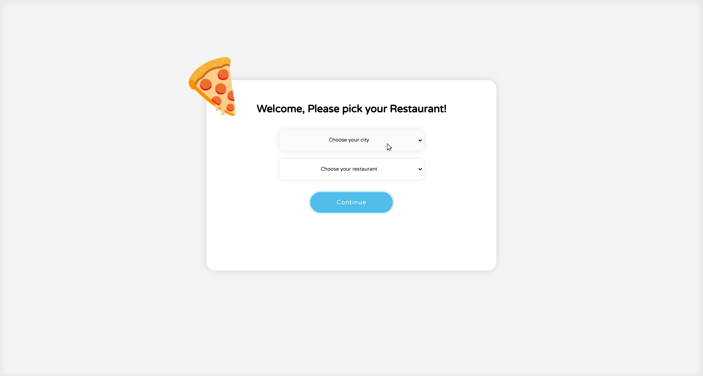
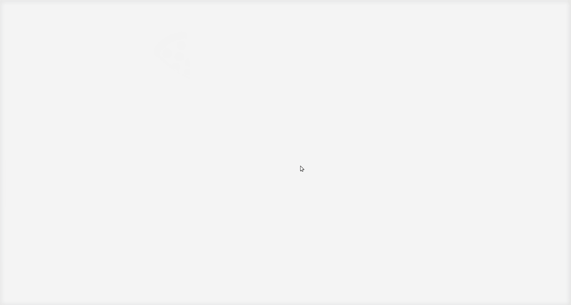
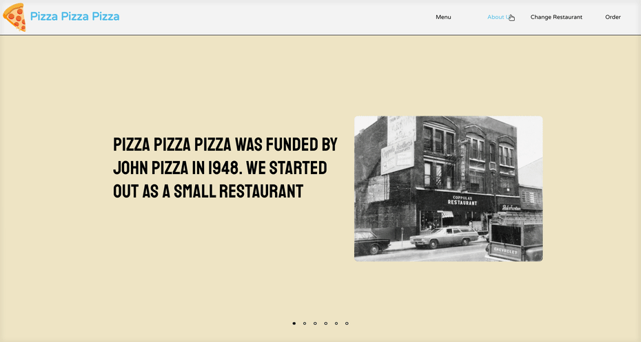
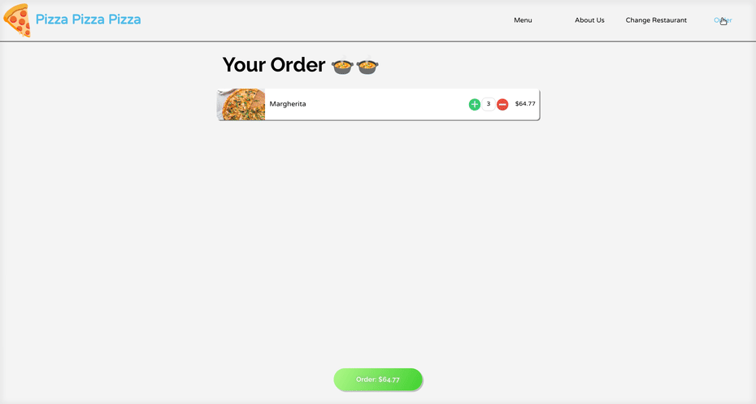

# Restaurant Website

### Description

This repository contains a simple restaurant website frontend, which I created when learning `React.js`. The frontend is fully featured and ready to accept product lists from a server.

### Setup

The project was setup via `create-react-project` in order to run it on your machine clone the repo and in the directory use:

- `npm install`
- `npm start`

### Website preview

##### Try it yourself! : https://behenate.github.io/restaurant-website/

**Or watch the GIFs below:**

Choosing restaurant location:

Using the menu:

About us page:

Ordering:

